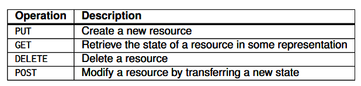

# Research

Christian Grubmüller

07.10.2021

- Welche grundlegenden Elemente müssen bei einer REST Schnittstelle zur Verfügung gestellt werden?

  1. *Resources are identified through a single naming scheme*
  2. *All services offer the same interface, consisting of at most four operations,*
     *as shown in Figure 2.7*
  3. *Messages sent to or from a service are fully self-described*
  4. *After executing an operation at a service, that component forgets every-*
     *thing about the caller* - [2] Seite 65

-  Wie stehen diese mit den HTTP-Befehlen in Verbindung? [2]

  

- Welche Datenbasis bietet sich für einen solchen Use-Case an?

  In diesem Use-Case bietet sich eine dokumentenbasierte Datenbank an, weil sich das Schema später ändern kann (z.B. Geburtsdatum, Präferenzen hinzufügen). Außerdem wird wesentlich häufiger auf die Daten lesen zugegriffen, als Daten geändert werden.

  Aufgrund des Problems mit dem Schema kommt eine relationale Datenbank(MySQL) nicht in Frage. Ich würde hier MongoDB verwenden.

- Welche Erfordernisse bezüglich der Datenbasis sollten hier bedacht werden?
  Dabei sollte beachtet werden, dass die Datenbank, die eine gute Schnittstelle hat, und man mithilfe einer API darauf zugreifen kann. 

- Verschiedene Frameworks bieten schnelle Umsetzungsmöglichkeiten,  welche Eckpunkte müssen jedoch bei einer öffentlichen Bereitstellung  (Production) von solchen Services beachtet werden?
  

## Quellen

[1] https://martinfowler.com/articles/richardsonMaturityModel.html (07.10.2021)

[2] Steen, Maarten van, and Tanenbaum, Andrew S. *Distributed Systems.* Third edition, Version 3.01 (2017). ed., [CreateSpace Independent Publishing Platform], 2017.